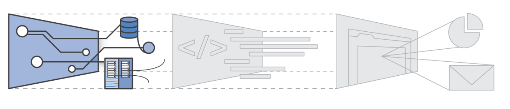
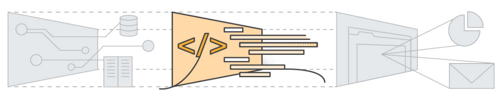

### Create AWS pipeline

[AWS](https://en.wikipedia.org/wiki/Amazon_Web_Services) provides cloud computing visualization technologies such as Iaas, PaaS.
Visit [AWS Official site](https://aws.amazon.com/) for a complete solution set.

### IaaS

Infrastructure as a Service, sometimes abbreviated as IaaS, contains the basic building blocks for cloud IT and typically provide access to networking features, computers (virtual or on dedicated hardware), and data storage space. Infrastructure as a Service provides you with the highest level of flexibility and management control over your IT resources and is most similar to existing IT resources that many IT departments and developers are familiar with today.



### PaaS

Platforms as a service remove the need for organizations to manage the underlying infrastructure (usually hardware and operating systems) and allow you to focus on the deployment and management of your applications. This helps you be more efficient as you don’t need to worry about resource procurement, capacity planning, software maintenance, patching, or any of the other undifferentiated heavy lifting involved in running your application.



  
### Logstash pipeline

Logstash acts as a data stream agregator and collects data from various sources.
In our case we will use AWS S3 storage

Also in logstash.conf standard we need to specify aws connection informaiton

### logstash.conf

```buildoutcfg
input {
	file {
		path => "/home/praslea/access_log“
		start_position=> "beginning"
		ignore_older=> 0
	}
}
filter {
	grok{
		match => { "message" => "%{COMBINEDAPACHELOG}" }}
		date {
			match => [ "timestamp", "dd/MMM/yyyy:HH:mm:ssZ" ]
		}
	}
output {
	elasticsearch{
	hosts => ["localhost:9200"]
	}
stdout{
	codec => rubydebug
	}
}
```

###  Input section
```buildoutcfg
input {
    s3 {
        bucket => "bucket_name"
        access_key_id=> "access_key_id"
        secret_access_key=> "access_key"
    }
}
```

### Create an AWS bucket

1) Create a [S3 bucket(Simple Storage Server)](https://aws.amazon.com/s3/)
2) Upload the a sample apache log

### Create an AWS user

After we create the AWS bucket we need to assign a user to it and add appropriate access rights:

1) Go to IAM (Identity and Access Management) and create a user
2) Choose programmatic access
3) Use S3 ReadOnly access permission and attach it to the user
4) Download the credentials.csv and setup the logstash input section


### Start Logstash specifing the aws.conf

References:
  * https://en.wikipedia.org/wiki/Amazon_Web_Services
  * https://aws.amazon.com/types-of-cloud-computing/