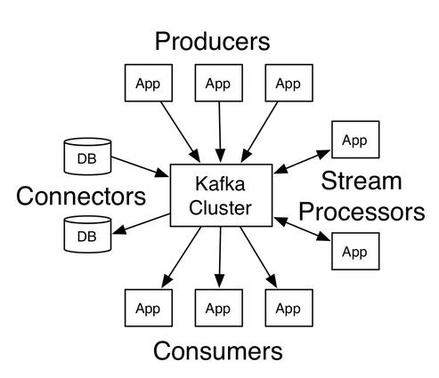

## Kafka pipeline

Apache Kafka is a distributed streaming platform. 
Kafka is generally used for two broad classes of applications:

* Building real-time streaming data pipelines that reliably get data between systems or applications
* Building real-time streaming applications that transform or react to the streams of data 

### Kafka Diagram



### Kafka installation

1) Install Zookeeper

```
apt-get install zookeeperd
```

2) Install Kafka

```
wget http://mirrors.hostingromania.ro/apache.org/kafka/2.2.1/kafka-2.2.1-src.tgz
tar -xzvf kafka-2.2.1-src.tgz
```

### Start Kafka server

```
bin/kafka-server-start.sh config/server.properties
```

### Issue starting kafka server

```
root@elkstack:/home/kafka-2.2.1-src# bin/kafka-server-start.sh config/server.properties 
Classpath is empty. Please build the project first e.g. by running './gradlew jar -PscalaVersion=2.12.8'
```

Seems to be working with this kafka version:

```
root@elastic:/home/kafka_2.12-2.3.0# bin/kafka-server-start.sh config/server.properties
[2019-08-20 12:54:36,900] INFO Registered kafka:type=kafka.Log4jController MBean (kafka.utils.Log4jControllerRegistration$)
[2019-08-20 12:54:37,858] INFO Registered signal handlers for TERM, INT, HUP (org.apache.kafka.common.utils.LoggingSignalHandler)
```

### Kafka default config options

```
/home/kafka-2.2.1-src/config# cat server.properties | grep -v "#" | grep -v "^$"
broker.id=0
num.network.threads=3
num.io.threads=8
socket.send.buffer.bytes=102400
socket.receive.buffer.bytes=102400
socket.request.max.bytes=104857600
log.dirs=/tmp/kafka-logs
num.partitions=1
num.recovery.threads.per.data.dir=1
offsets.topic.replication.factor=1
transaction.state.log.replication.factor=1
transaction.state.log.min.isr=1
log.retention.hours=168
log.segment.bytes=1073741824
log.retention.check.interval.ms=300000
zookeeper.connect=localhost:2181
zookeeper.connection.timeout.ms=6000
group.initial.rebalance.delay.ms=0
```

<<<<<<< HEAD

### Setup kafka streams

1) Download latest kafka & unpack

```
wget http://mirror.evowise.com/apache/kafka/2.3.0/kafka_2.12-2.3.0.tgz
tar -xzf kafka_2.12-2.3.0.tgz
```

2) Start kafka service

```
bin/zookeeper-server-start.sh config/zookeeper.properties
bin/kafka-server-start.sh config/server.properties
```
3) Create a kafka topic
```
```

4) Create a custom logstash.config file for kafka streaming and start logstash with it

```
 /usr/share/logstash/bin/logstash -f /etc/logstash/conf.d/logstash-kafka.conf
```

5) Start Kafka producers

```
bin/kafka-console-producer.sh --broker-list localhost:9092 --topic kafka-logs < /home/praslea/access_log
```

### Successful log ingestion

```
{
           "verb" => "GET",
          "agent" => "\"W3 Total Cache\"",
       "clientip" => "54.210.20.202",
          "bytes" => "555",
       "referrer" => "\"http://sundog-soft.com/product-sitemap.xml\"",
       "response" => "200",
        "message" => "54.210.20.202 - - [05/May/2017:18:01:43 +0000] \"GET /product-sitemap.xml HTTP/1.1\" 200 555 \"http://sundog-soft.com/product-sitemap.xml\" \"W3 Total Cache\"",
        "request" => "/product-sitemap.xml",
      "timestamp" => "05/May/2017:18:01:43 +0000",
           "auth" => "-",
    "httpversion" => "1.1",
          "ident" => "-",
       "@version" => "1",
     "@timestamp" => 2017-05-05T18:01:43.000Z
}
{
           "verb" => "GET",
          "agent" => "\"W3 Total Cache\"",
       "clientip" => "54.210.20.202",
          "bytes" => "658",
       "referrer" => "\"http://sundog-soft.com/creativo_portfolio-sitemap.xml\"",
       "response" => "200",
        "message" => "54.210.20.202 - - [05/May/2017:18:01:44 +0000] \"GET /creativo_portfolio-sitemap.xml HTTP/1.1\" 200 658 \"http://sundog-soft.com/creativo_portfolio-sitemap.xml\" \"W3 Total Cache\"",
        "request" => "/creativo_portfolio-sitemap.xml",
      "timestamp" => "05/May/2017:18:01:44 +0000",
           "auth" => "-",
    "httpversion" => "1.1",
          "ident" => "-",
       "@version" => "1",
     "@timestamp" => 2017-05-05T18:01:44.000Z
}
```

=======
### Check successful run

```
root@elastic:/home/kafka_2.12-2.3.0# bin/kafka-topics.sh --create --bootstrap-server localhost:9092 --replication-factor 1 --partitions 1 --topic test
root@elastic:/home/kafka_2.12-2.3.0# bin/kafka-topics.sh --list --bootstrap-server localhost:9092
__consumer_offsets
kafka-logs
test
```

Run ok

### Issues running multiple topics

```
bin/kafka-topics.sh --create zookeeper:2181 --replication-factor 1 partitions 1 --topic kafka.logs
Exception in thread "main" java.lang.IllegalArgumentException: Only one of --bootstrap-server or --zookeeper must be specified
        at kafka.admin.TopicCommand$TopicCommandOptions.checkArgs(TopicCommand.scala:628)
        at kafka.admin.TopicCommand$.main(TopicCommand.scala:50)
        at kafka.admin.TopicCommand.main(TopicCommand.scala)
```

Try to delete the ongoing topics

```
root@elastic:/home/kafka_2.12-2.3.0# history | tail -5
  518  Exception in thread "main" java.lang.IllegalArgumentException: Only one of --bootstrap-server or --zookeeper must be specified
  519          at kafka.admin.TopicCommand$TopicCommandOptions.checkArgs(TopicCommand.scala:628)
  520          at kafka.admin.TopicCommand$.main(TopicCommand.scala:50)
  521          at kafka.admin.TopicCommand.main(TopicCommand.scala)
  522  history | tail -5
```
### Other

```
root@elastic:/home/kafka_2.12-2.3.0# bin/kafka-topics.sh --create zookeeper:2181 --replication-factor 1 partitions 1 --topic kafka.logs
Exception in thread "main" java.lang.IllegalArgumentException: Only one of --bootstrap-server or --zookeeper must be specified
        at kafka.admin.TopicCommand$TopicCommandOptions.checkArgs(TopicCommand.scala:628)
        at kafka.admin.TopicCommand$.main(TopicCommand.scala:50)
        at kafka.admin.TopicCommand.main(TopicCommand.scala)
root@elastic:/home/kafka_2.12-2.3.0# bin/kafka-topics.sh --create zookeeper localhost:2181 --replication-factor 1 partitions 1 --topic kafka.logs
Exception in thread "main" java.lang.IllegalArgumentException: Only one of --bootstrap-server or --zookeeper must be specified
        at kafka.admin.TopicCommand$TopicCommandOptions.checkArgs(TopicCommand.scala:628)
        at kafka.admin.TopicCommand$.main(TopicCommand.scala:50)
        at kafka.admin.TopicCommand.main(TopicCommand.scala)
root@elastic:/home/kafka_2.12-2.3.0# bin/kafka-topics.sh --list --bootstrap-server localhost:9092     
```

### Delete topics

```
root@elastic:/home/kafka_2.12-2.3.0# bin/kafka-topics.sh --zookeeper localhost:2181 --describe --topic kafka-logs
Topic:kafka-logs        PartitionCount:1        ReplicationFactor:1     Configs:
        Topic: kafka-logs       Partition: 0    Leader: 0       Replicas: 0     Isr: 0
root@elastic:/home/kafka_2.12-2.3.0# bin/kafka-topics.sh --zookeeper localhost:2181 --describe --topic test
Topic:test      PartitionCount:1        ReplicationFactor:1     Configs:
        Topic: test     Partition: 0    Leader: 0       Replicas: 0     Isr: 0
root@elastic:/home/kafka_2.12-2.3.0# bin/kafka-topics.sh --zookeeper localhost:2181 --delete --topic test
Topic test is marked for deletion.
Note: This will have no impact if delete.topic.enable is not set to true.
```
### Another error

```
root@elastic:/home/kafka_2.12-2.3.0# bin/kafka-topics.sh --create zookeeper:2181 --replication-factor 1 partitions 1 --topic kafka-logs
Exception in thread "main" java.lang.IllegalArgumentException: Only one of --bootstrap-server or --zookeeper must be specified
        at kafka.admin.TopicCommand$TopicCommandOptions.checkArgs(TopicCommand.scala:628)
        at kafka.admin.TopicCommand$.main(TopicCommand.scala:50)
        at kafka.admin.TopicCommand.main(TopicCommand.scala)
root@elastic:/home/kafka_2.12-2.3.0# bin/kafka-topics.sh --create Only one of --bootstrap-server or --zookeeper must be specified --replication-factor 1 partitions 1 --topic kafka-logs
```

Correct version from official site

```
 bin/kafka-topics.sh --create --bootstrap-server localhost:9092 --replication-factor 1 --partitions 1 --topic kafka-logs
root@elastic:/home/kafka_2.12-2.3.0#
```
>>>>>>> 92fdc05d0c1a585259062929bd3464d230861258
